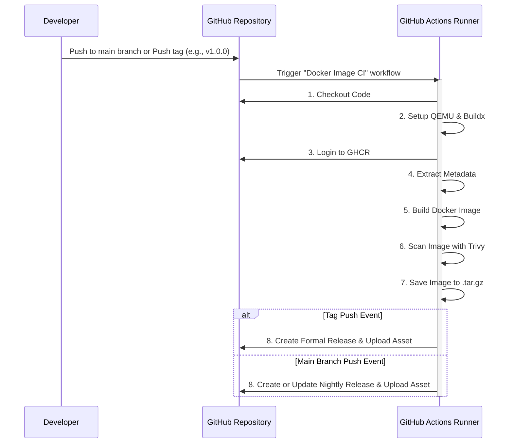

# streamlit_sample_app

github actions で docker image まで作成するためのテストアプリ

## 前提条件

- vs code
- docker desktop
- uv: python package 管理
  - install: `winget install --id=astral-sh.uv`

## 準備

- git clone
- vscode で開く
- python 仮想環境構築
  - ターミナルにて以下を実行
    - `uv sync --frozen`

## デバッグ

- vscode サイドパネルの「実行とデバッグ」に 「streamlit debug」を選択して実行
  - 選択済みなら、 F5 でも OK

## docker 

### ローカルでのビルド及び実行

```bash
docker compose build
docker compose up -d
```

コンテナを停止・削除するには:

```bash
docker compose down
```

## github actions

[docker-image.yml](./.github/workflows/docker-image.yml) にて  
main への push や tag 付けのタイミングで、docker image の作成まで行っている

github container registry に  
生成された docker image を push しているが、  
free plan の private repositry だと 容量制限が厳しい  

そのため、  
tag 付けの際、 release まで行うように設定し、  
その assets として 添付するようにした  
（release の assets には、1ファイル 2GB までだが、トータルの容量制限は無いっぽい ）

### シーケンス図


### リリースされたイメージの利用方法

GitHub Releases ページからダウンロードした  
`streamlit_sample_app-docker-image-vX.Y.Z.tar.gz`  
(または `streamlit_sample_app-docker-image-nightly.tar.gz`)   
ファイルを使ってコンテナを実行する手順です。

1. **イメージのダウンロード**
   - リリースページから `streamlit_sample_app-docker-image-vX.Y.Z.tar.gz` のようなアセットをダウンロードします。
1. **Dockerへのイメージ読み込み**
   - ターミナルで以下のコマンドを実行してください。
    ```bash
    # streamlit_sample_app-docker-image-vX.Y.Z.tar.gz を実際のファイル名に置き換えてください
    docker load -i streamlit_sample_app-docker-image-vX.Y.Z.tar.gz
    ```
1. **コンテナの実行**
   - 読み込んだイメージを使ってコンテナを起動します。`-d` でバックグラウンド実行、`-p` でポートをPCの8501番に接続します。  
     `--rm` を付けることで、コンテナ停止時に自動で削除されます。`--name`でコンテナに名前を付けておくと、後で停止するのが簡単になります。
    ```bash
    # 上記で読み込まれたイメージ名とタグに置き換えてください
    docker run -d --rm --name streamlit_sample_app -p 8501:8501 ghcr.io/sifi-imaging-temp-org/streamlit_sample_app:vX.Y.Z

    # http://localhost:8501/ で確認
    ```
1. **コンテナの停止**
   - 以下のコマンドでコンテナを停止します。`--rm` オプションを付けているため、コンテナは自動的に削除されます。
    ```bash
    docker stop streamlit_sample_app
    ```

## issue へのリンクテスト

#1